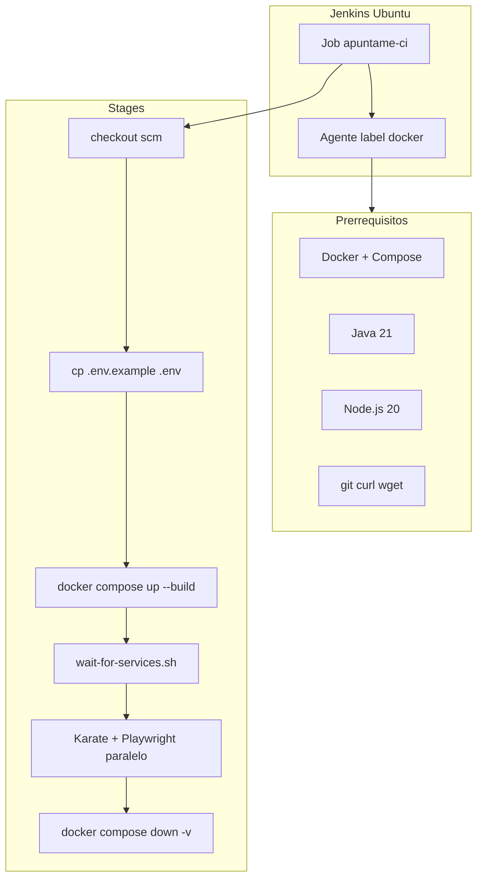

# Configuración de Jenkins para Apuntame CI/CD

Guía paso a paso para un agente automatizado (clawbot) que instale y configure Jenkins en **Ubuntu/Debian** y ejecute el pipeline del repositorio Apuntame.

**Repositorio:** `https://github.com/B3RT1C/apuntame.git`  
**Rama del pipeline:** `test`  
**Script del pipeline:** `Jenkinsfile` (raíz del repo)

---

## 1. Qué hace el pipeline



| Stage | Acción |
|-------|--------|
| Checkout | Clona el commit que disparó el build |
| Prepare | Copia `.env.example` → `.env` |
| Build and start stack | `docker compose -f docker-compose.test.yml up -d --build` |
| Tests (paralelo) | Karate (`mvnw verify -Ptest-api`) + Playwright (`npm run test:ci`) |
| post always | Baja contenedores y borra volúmenes (`down -v`) |

**Requisitos críticos del Jenkinsfile:**

- Agente con label **`docker`** (obligatorio).
- Usuario `jenkins` debe poder ejecutar **`docker compose`** sin `sudo`.
- Puertos **80** y **8080** libres en el host durante el build (mapeados por `docker-compose.test.yml`).
- Variables ya definidas en el pipeline: `CI=true`, `BASE_URL=http://localhost`, `API_BASE_URL=http://localhost:8080`.

---

## 2. Requisitos de la máquina

| Recurso | Mínimo | Recomendado |
|---------|--------|-------------|
| SO | Ubuntu 22.04/24.04 LTS | Ubuntu 24.04 LTS |
| RAM | 4 GB | 8 GB |
| Disco libre | 20 GB | 40 GB |
| CPU | 2 cores | 4 cores |

**Software a instalar:**

| Componente | Versión | Uso |
|------------|---------|-----|
| Jenkins LTS | Última LTS | Orquestación CI |
| Docker Engine + Compose plugin | Reciente | Stack postgres + backend + frontend |
| OpenJDK | 21 | Maven / Karate |
| Node.js | 20.x | Playwright / npm |
| git, curl, wget | — | Checkout y healthchecks |

---

## 3. Variables que clawbot necesita del usuario

Antes de empezar, recopilar:

| Variable | Ejemplo | Descripción |
|----------|---------|-------------|
| `GITHUB_USERNAME` | `B3RT1C` | Usuario de GitHub |
| `GITHUB_PAT` | `ghp_xxxx` | Personal Access Token con scope `repo` |
| `JENKINS_ADMIN_USER` | `admin` | Usuario admin de Jenkins |
| `JENKINS_ADMIN_PASSWORD` | (seguro) | Contraseña admin Jenkins |

### Crear el PAT en GitHub

1. GitHub → **Settings** → **Developer settings** → **Personal access tokens** → **Tokens (classic)**.
2. **Generate new token (classic)**.
3. Scope mínimo: **`repo`** (acceso lectura a repositorios privados).
4. Copiar el token; no se vuelve a mostrar.

---

## 4. Instalación — Bloque 0: sistema base

```bash
sudo apt update
sudo apt install -y ca-certificates curl gnupg git wget openjdk-21-jdk
```

**Verificar:**

```bash
java -version   # debe mostrar openjdk 21
git --version
```

---

## 5. Instalación — Bloque 1: Docker

```bash
# Añadir repositorio oficial Docker
sudo install -m 0755 -d /etc/apt/keyrings
curl -fsSL https://download.docker.com/linux/ubuntu/gpg | sudo gpg --dearmor -o /etc/apt/keyrings/docker.gpg
sudo chmod a+r /etc/apt/keyrings/docker.gpg

echo "deb [arch=$(dpkg --print-architecture) signed-by=/etc/apt/keyrings/docker.gpg] \
  https://download.docker.com/linux/ubuntu $(. /etc/os-release && echo "$VERSION_CODENAME") stable" | \
  sudo tee /etc/apt/sources.list.d/docker.list > /dev/null

sudo apt update
sudo apt install -y docker-ce docker-ce-cli containerd.io docker-buildx-plugin docker-compose-plugin
```

**Verificar:**

```bash
docker --version
docker compose version
sudo docker run --rm hello-world
```

---

## 6. Instalación — Bloque 2: Node.js 20

```bash
curl -fsSL https://deb.nodesource.com/setup_20.x | sudo -E bash -
sudo apt install -y nodejs
```

**Verificar:**

```bash
node -v   # v20.x
npm -v
```

---

## 7. Instalación — Bloque 3: Jenkins LTS

```bash
sudo install -m 0755 -d /etc/apt/keyrings
curl -fsSL https://pkg.jenkins.io/debian-stable/jenkins.io-2023.key | \
  sudo tee /etc/apt/keyrings/jenkins-keyring.asc > /dev/null

echo "deb [signed-by=/etc/apt/keyrings/jenkins-keyring.asc] \
  https://pkg.jenkins.io/debian-stable binary/" | \
  sudo tee /etc/apt/sources.list.d/jenkins.list > /dev/null

sudo apt update
sudo apt install -y jenkins
```

**Permitir que Jenkins use Docker:**

```bash
sudo usermod -aG docker jenkins
sudo systemctl enable jenkins docker
sudo systemctl restart docker jenkins
```

**Verificar (esperar ~30 s tras el restart):**

```bash
sudo -u jenkins docker ps
sudo systemctl status jenkins --no-pager
```

**Contraseña inicial de Jenkins:**

```bash
sudo cat /var/lib/jenkins/secrets/initialAdminPassword
```

Abrir en navegador: `http://<IP_SERVIDOR>:8080`

> **Nota:** El puerto 8080 de Jenkins es la UI de Jenkins. Durante el build, el pipeline también usa el puerto 8080 del **host** para el backend de tests. Si Jenkins y el stack de tests compiten por el mismo 8080, ver sección Troubleshooting (cambiar puerto del stack o usar agente dedicado).

---

## 8. Configuración inicial de Jenkins (UI)

1. Pegar `initialAdminPassword` → **Continue**.
2. **Install suggested plugins** (o instalar plugins listados en Bloque 4).
3. Crear usuario admin (`JENKINS_ADMIN_USER` / `JENKINS_ADMIN_PASSWORD`).
4. Dejar URL por defecto (`http://<IP>:8080/`).

---

## 9. Instalación — Bloque 4: Plugins obligatorios

En **Manage Jenkins → Plugins → Available**, instalar:

| Plugin | Obligatorio | Motivo |
|--------|-------------|--------|
| Pipeline | Sí | Pipeline declarativo |
| Git | Sí | `checkout scm` |
| JUnit | Sí | Publicar resultados Karate/Playwright |
| HTML Publisher | Sí | Reportes HTML |
| Credentials Binding | Sí | PAT de GitHub |
| Timestamper | Recomendado | Logs con timestamp |
| Workspace Cleanup | Recomendado | Limpiar workspace |

**Alternativa por CLI** (si `jenkins-plugin-cli` está disponible):

```bash
sudo jenkins-plugin-cli --plugins \
  pipeline-stage-view git junit htmlpublisher credentials-binding timestamper ws-cleanup
sudo systemctl restart jenkins
```

---

## 10. Configuración — Bloque 5: Label `docker` en el agente

El `Jenkinsfile` exige `agent { label 'docker' }`.

**Jenkins monolítico (controller ejecuta builds):**

1. **Manage Jenkins → Nodes → Built-In Node → Configure**.
2. **Labels:** añadir `docker` (sin espacios extra).
3. **# of executors:** `2` (Karate y Playwright corren en paralelo).
4. Guardar.

**Verificar:** en la configuración del nodo debe aparecer `Labels: docker`.

---

## 11. Configuración — Bloque 6: Credencial GitHub PAT

1. **Manage Jenkins → Credentials → (global) → Add Credentials**.
2. Tipo: **Username with password**.
3. Campos:

| Campo | Valor |
|-------|-------|
| Username | `GITHUB_USERNAME` (ej. `B3RT1C`) |
| Password | `GITHUB_PAT` |
| ID | `github-pat-apuntame` |
| Description | `GitHub PAT para repo apuntame` |

> El **ID debe ser exactamente** `github-pat-apuntame` si se sigue esta guía al crear el job.

---

## 12. Configuración — Bloque 7: Crear el Pipeline Job

1. **New Item** → nombre: **`apuntame-ci`** → tipo **Pipeline** → OK.
2. En **Pipeline**:
   - **Definition:** Pipeline script from SCM
   - **SCM:** Git
   - **Repository URL:** `https://github.com/B3RT1C/apuntame.git`
   - **Credentials:** `github-pat-apuntame`
   - **Branches to build:** `*/test`
   - **Script Path:** `Jenkinsfile`
3. (Opcional) **Build Triggers → Poll SCM:** `H/5 * * * *` (cada 5 min) o configurar webhook GitHub.
4. Guardar.

---

## 13. Primera ejecución

1. En el job `apuntame-ci`, clic **Build Now**.
2. Abrir **Console Output** y seguir el progreso.

**Checklist de éxito:**

| # | Comprobación |
|---|--------------|
| 1 | Stage `Checkout` termina sin error 401 |
| 2 | `docker compose ... up -d --build` construye backend y frontend |
| 3 | `wait-for-services.sh` imprime "Todos los servicios están listos" |
| 4 | Stage `API tests - Karate` → BUILD SUCCESS |
| 5 | Stage `E2E tests - Playwright` → tests passed |
| 6 | En la UI: **Test Result** con tests JUnit |
| 7 | Enlaces **Karate Report** y **Playwright Report** (HTML Publisher) |
| 8 | Tras el build: `sudo docker ps` no muestra `apuntame-test-*` |

**Tiempo estimado primer build:** 10–20 minutos (descarga dependencias Maven, npm, Chromium, imágenes Docker).

---

## 14. Permisos de scripts en el repositorio

El archivo `backend/mvnw` está versionado en git **sin** bit ejecutable (`100644`). En un checkout limpio, `./mvnw` falla con `Permission denied`.

El `Jenkinsfile` ya incluye en el stage **Prepare environment**:

```groovy
sh 'chmod +x backend/mvnw scripts/wait-for-services.sh'
```

**Si se modifica el pipeline manualmente**, asegurarse de que ese `chmod` exista antes de invocar `./mvnw` o `./scripts/wait-for-services.sh`.

**Corrección permanente en el repo (opcional, en máquina de desarrollo):**

```bash
git update-index --chmod=+x backend/mvnw
git update-index --chmod=+x scripts/wait-for-services.sh
git commit -m "Make mvnw and wait-for-services.sh executable in git"
```

---

## 15. Script Security (si aparece)

Si Jenkins bloquea métodos del pipeline:

1. **Manage Jenkins → In-process Script Approval**.
2. Aprobar firmas pendientes relacionadas con `checkout scm`, `publishHTML`, `archiveArtifacts`.

---

## 16. Firewall

```bash
# Solo exponer la UI de Jenkins (ajustar interfaz según necesidad)
sudo ufw allow 8080/tcp
sudo ufw enable
```

No es necesario exponer los puertos 80/8080 del stack de tests al exterior; solo los usa el pipeline en `localhost` del agente.

---

## 17. Troubleshooting

| Síntoma | Causa probable | Solución |
|---------|----------------|----------|
| `No node available with label 'docker'` | Label no configurado | Añadir `docker` al Built-In Node (sección 10) |
| `permission denied` al ejecutar `docker` | `jenkins` fuera del grupo `docker` | `sudo usermod -aG docker jenkins && sudo systemctl restart jenkins` |
| `Got permission denied while trying to connect to the Docker daemon` | Mismo que arriba | Reiniciar Jenkins tras añadir al grupo |
| `port 80 already in use` | nginx/apache en el host | `sudo systemctl stop nginx` o cambiar puerto en `docker-compose.test.yml` |
| `port 8080 already in use` | Jenkins UI usa 8080 y choca con backend de tests | Cambiar mapeo del backend en compose a `8081:8080` y `API_BASE_URL` en Jenkinsfile, o usar agente sin Jenkins en 8080 |
| `checkout scm` / `git fetch` 401 o 403 | PAT inválido o sin scope `repo` | Regenerar PAT y actualizar credencial |
| `./mvnw: Permission denied` | mvnw no ejecutable tras checkout | Verificar `chmod +x backend/mvnw` en stage Prepare |
| `wait-for-services.sh: Permission denied` | Script sin ejecutable | `chmod +x scripts/wait-for-services.sh` |
| Backend no responde a tiempo | Spring Boot lento o error de DB | `docker compose -f docker-compose.test.yml logs backend` |
| Playwright timeout / fallos E2E | Frontend no listo o puerto 80 ocupado | `docker compose logs frontend` |
| HTML Publisher no muestra reporte | Ruta incorrecta o build falló antes | Verificar que existan `e2e/playwright-report/index.html` y `backend/target/karate-reports/karate-summary.html` |
| Tests Karate fallan por datos | DB con estado sucio de build anterior | Verificar que `post always` ejecuta `down -v` |

### Comandos de diagnóstico (ejecutar como clawbot)

```bash
# Estado Jenkins
sudo systemctl status jenkins --no-pager
sudo tail -n 100 /var/log/jenkins/jenkins.log

# Probar Docker como jenkins
sudo -u jenkins docker ps
sudo -u jenkins docker compose version

# Durante un build fallido (en workspace del job)
sudo -u jenkins bash -c 'cd /var/lib/jenkins/workspace/apuntame-ci && docker compose -f docker-compose.test.yml ps'
sudo -u jenkins bash -c 'cd /var/lib/jenkins/workspace/apuntame-ci && docker compose -f docker-compose.test.yml logs --tail=50 backend'

# Puertos en uso
sudo ss -tlnp | grep -E ':80|:8080'
```

### Re-ejecutar tests manualmente en el servidor (debug)

```bash
cd /var/lib/jenkins/workspace/apuntame-ci
cp .env.example .env
docker compose -f docker-compose.test.yml up -d --build
chmod +x scripts/wait-for-services.sh backend/mvnw
./scripts/wait-for-services.sh

cd backend && ./mvnw verify -Ptest-api -Dkarate.env=docker
cd ../e2e && npm ci && npx playwright install --with-deps chromium && CI=true npm run test:ci

docker compose -f docker-compose.test.yml down -v
```

---

## 18. Mejoras opcionales (fase posterior)

- **Webhook GitHub** en lugar de Poll SCM (respuesta inmediata a push).
- **Cache Maven** (`/var/lib/jenkins/.m2`) entre builds.
- **Cache Playwright** (`/var/lib/jenkins/.cache/ms-playwright`) entre builds.
- **Credencial Jenkins** para `JWT_SECRET` en lugar de usar solo `.env.example`.
- **Agente dedicado** (otra VM) con label `docker`; controller solo orquesta.
- **Notificaciones** en `post { failure { ... } }` (email, Slack, etc.).

---

## 19. Resumen de entregables para clawbot

Al finalizar, clawbot debe confirmar:

- [ ] Jenkins accesible en `http://<IP>:8080`
- [ ] Usuario admin creado
- [ ] Plugins instalados (Pipeline, Git, JUnit, HTML Publisher)
- [ ] Label `docker` en el agente
- [ ] Credencial `github-pat-apuntame` configurada
- [ ] Job `apuntame-ci` apunta a rama `test` y `Jenkinsfile`
- [ ] Primer build **azul** (éxito) o logs de error adjuntos para revisión

---

## 20. Referencias en el repositorio

| Archivo | Descripción |
|---------|-------------|
| `Jenkinsfile` | Pipeline CI/CD |
| `docker-compose.test.yml` | Stack de tests |
| `.env.example` | Variables para el stack |
| `scripts/wait-for-services.sh` | Espera healthchecks |
| `backend/pom.xml` | Perfil Maven `-Ptest-api` (Karate) |
| `e2e/package.json` | Script `npm run test:ci` (Playwright) |
